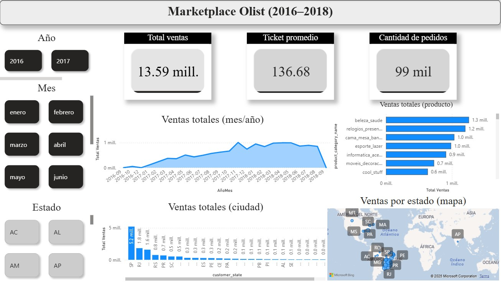

Laboratorio II – Power BI (Informatorio Chaco)
Análisis de Ventas – Marketplace Olist

Este proyecto corresponde al Laboratorio II de Power BI, donde se aplicaron técnicas de ETL, modelado de datos, creación de medidas DAX y armado de un dashboard interactivo para analizar el comportamiento de ventas del marketplace Olist.

1️⃣ Fuentes de datos utilizadas

Se trabajó con tres orígenes distintos:

CSV del dataset Olist (órdenes, clientes, productos, ítems).

Excel externo: Dim_Regiones_Brasil.xlsx para agregar una dimensión geográfica adicional.

URL externa, incorporada como tercer origen requerido por la consigna.

2️⃣ Proceso ETL (Power Query)

Principales transformaciones realizadas:

Ajuste de tipos de datos y renombrado de columnas.

Limpieza y verificación de claves (sin nulos en order_id, product_id, customer_id).

Creación de columnas temporales AñoMes y AñoMesOrden, ante conflicto regional al crear una tabla de calendario con DAX.

Integración de la tabla Dim_Regiones y normalización del campo customer_state.

3️⃣ Modelado de Datos (Esquema Estrella)

Tabla de hechos:

olist_order_items_dataset

Dimensiones:

olist_orders_dataset

olist_customers_dataset

olist_products_dataset

Dim_Regiones

Todas las relaciones se definieron como 1 a muchos (1:*), con filtrado en ambas direcciones para asegurar interactividad total.

4️⃣ Medidas DAX principales

Total Ventas

Ticket Promedio

Cantidad de Pedidos

Estas medidas alimentan los KPIs del dashboard.

5️⃣ Visualizaciones del Dashboard

KPIs de ventas, ticket promedio y cantidad de pedidos

Gráfico de líneas (tendencia mensual)

Gráfico de barras por categoría de producto

Distribución por estado

Mapa geográfico con ventas por estado

Segmentadores por Año y Mes

6️⃣ Conclusiones de las preguntas de negocio
📌 1. ¿Cómo evoluciona el volumen de ventas en el tiempo?

Se observa una tendencia creciente desde mediados de 2017, alcanzando máximos entre finales de 2017 y mediados de 2018. La caída abrupta de los últimos meses se debe a la falta de registros posteriores.

📌 2. ¿Qué categorías generan mayor facturación?

Las categorías con mayor aporte económico fueron:

beleza_saude

relogios_presentes

cama_mesa_banho
Estas concentran gran parte de la facturación total.

📌 3. ¿Qué regiones/estados generan más ventas?

El estado de São Paulo (SP) domina ampliamente las ventas, seguido por RJ, MG y RS.
La región Sudeste es la más fuerte comercialmente.

Archivos incluidos

Laboratorio 2b.pbix

Laboratorio 2 - Informe.pdf

Dim_Regiones_Brasil.xlsx

Autor

Jose Audicio – Informatorio Chaco (2025)
